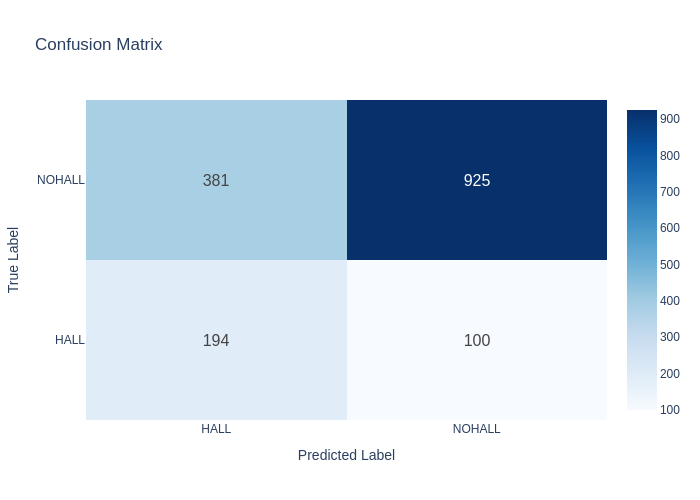

# Mirage: A Unified Library for Benchmarking Factual Consistency

**Authors**: _Your Name_, _Your Advisor_  
**Affiliation**: _Your Institution / Research Group_  
**Status**: Research Resource Paper Submission (2025)  
**License**: TODO

---

## 🧭 Overview

**Mirage** is a modular Python library for benchmarking factual consistency in natural language generation. It offers a standardized interface to load, evaluate, and visualize results across multiple classes of factuality metrics including:

- Classification-based (e.g., FactCC, TrueTeacher)
- QA/QG-based (e.g., QAGS, FEQA)
- Entity-based (e.g., FactAcc)

This library is designed for researchers and practitioners aiming to evaluate model outputs (e.g., summaries, translations, generated text) against reference/source texts for factual consistency.

---

## 📦 Installation

```bash
git clone https://github.com/YOUR_USERNAME/mirage.git
cd mirage
pip install -r requirements.txt
python -m spacy download en_core_web_sm  # Required for FEQA
```

Optional (for saving interactive plots):
```bash
pip install kaleido mpld3
```

## 🔧 Usage Guide
### Load and Evaluate with a Metric

#### Simple usage example
```python
from mirage import factcc
import pandas as pd

metric = factcc()

metric.evaluate_dataset("input/test_data.json")

metric.save_results("test/")
```

#### Complex usage example
```python
from mirage import factcc

metric = factcc()
metric.create_pipeline(device="cuda:0")

map_kwargs = {"batched": True, "batch_size": 10}

metric.evaluate_dataset(
    dataset="input/summaries.json",
    source_col="source",
    gen_col="summary",
    truncation=True,
    save_result_dataset_folder_path="test/results",
    map_kwargs=map_kwargs)
```

Supported formats for dataset:
- str path to .json or .csv file
- HuggingFace Dataset
- pandas.DataFrame


### Evaluate Multiple Metrics (e.g., QAGS and FEQA)

```python
from mirage import qags, feqa

metric1 = qags()
metric2 = feqa()

evaluated_qags = metric1.evaluate_dataset(
    dataset="data/generated_outputs.csv",
    source_col="source",
    gen_col="summary"
)

evaluated_feqa = metric2.evaluate_dataset(
    dataset="data/generated_outputs.csv",
    source_col="source",
    gen_col="summary"
)
```

### Compute Benchmark Scores

```python
from mirage import ScoreManager

# Choose metrics
metric_list = [
    "data_stats", "f1", "precision", "recall", "accuracy",
    "balanced_accuracy", "mcc", "kappa", "log_loss",
    "auroc", "auprc", "confusion_matrix"
]

# Run ScoreManager with computed scores
scores = ScoreManager(
    dataset=evaluated_qags,
    metric_list=metric_list
)

# View metrics
display(score_manager.results)
```

```python
{'data_stats': {'total_samples': 1600,
                'pos_count': 294,
                'neg_count': 1306,
                'pos_ratio': 0.18375,
                'neg_ratio': 0.81625,
                'mean_score': 0.3590182378063014,
                'std_score': 0.4552094161573908},
 'f1': np.float64(0.7298600379929493),
 'precision': np.float64(0.7986115058324497),
 'recall': np.float64(0.699375),
 'accuracy': 0.699375,
 'balanced_accuracy': np.float64(0.6840667354231126),
 'mcc': np.float64(0.2971356110137876),
 'kappa': np.float64(0.268649624631759),
 'log_loss': 1.532389884192878,
 'auroc': np.float64(0.7606728755820859),
 'auprc': np.float64(0.37180241868115116),
 'confusion_matrix': array([[194, 100],
                            [381, 925]])}
```

### Plot Benchmark scores

```python
# Choosing metrics to plot
plot_list = ["metrics_bar", "roc_curve", "precision_recall_curve", "confusion_matrix"]

# Plot results
scores.plot(
    plot_list=plot_list,
    metrics_bar=["f1", "accuracy", "precision", "recall"],
    show_plots=True,
    save_plots=True,
    output_path="results/plots/",
    save_format="png",
    interactive=False
)
```


For combined plots:

```python
scores.combined_plots(
    plot_list=plot_list,
    title="FactCC Evaluation",
    show_plot=True,
    save_path="results/plots/combined_metrics.png"
)
```
## 🧠 Metric Overview
Metric	Type	Description
FactCC	Classifier	Predicts factual correctness using a fine-tuned BERT model
TrueTeacher	Classifier	Uses large T5 model to assess entailment/correctness
QAGS	QG + QA	Compares answers to generated questions from source/gen text
FEQA	QG + QA	Uses NER-based entity masking for question generation
FactAcc	Entity-Match	Extracts subject-relation-object triplets using REBEL

## 💾 Saving and Exporting

```python
# Save results in HF format (disk-backed)
metric.save_results("results/factcc", format="hf")

# Save results as CSV or JSON
metric.save_results("results/factcc", format="csv")
metric.save_results("results/factcc", format="json", indent=2)
```

## 🧪 Example Notebook

See benchmarking.ipynb for end-to-end examples.

## 🧬 Acknowledgments

This work is part of the SimpleText ANR Project and supported by the University of Amsterdam, LORIA, and CNRS.


## 📄 Citation

_Paper submitted, under review_
